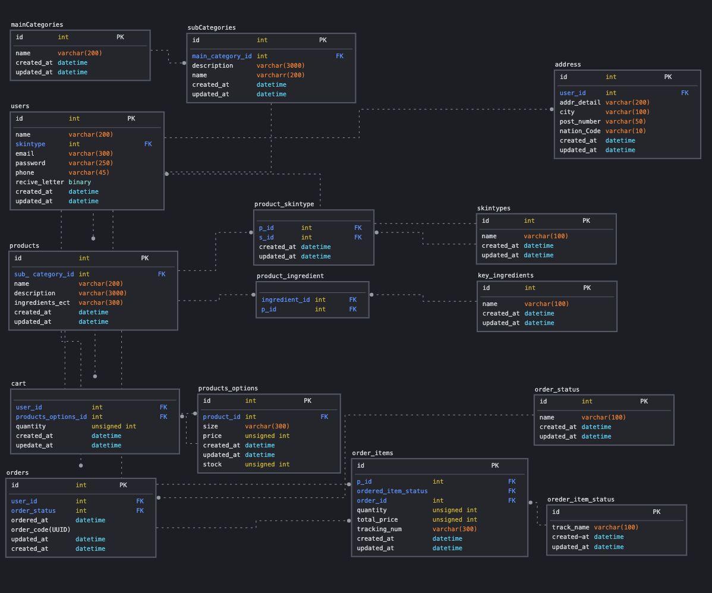

# Wesop

### 목차

[1. 프로젝트 소개](#프로젝트-소개)  
[2. 요구 사항](#요구-사항)  
[3. 구현 내용](#구현-내용)

## 프로젝트 소개
피부를 생각하는 자연적인 무드의 스킨케어 제품 사이트

### 개발 기간
2022.01.31 ~ 2022.02.11

### 팀원
총 5명  
프론트 : 김지윤, 박겸영, 정지민     
백엔드 : 김혜린, 모휘정

### 사용 기술
`Python 3.8` `Django 2.4.1`, `MySQL`, `AWS-EC2`, `AWS-RDS`, `GitHub` 

### 개발 환경
OS : Unbuntu@21.04(김혜린), mac M1(모휘정)   
IDE : VScode

### 파일 구조
```
$ tree
.
|-- manage.py // 
|-- pull_request_template.md
|-- requirements.txt // dependency
|-- README.md
|-- wesopERD.png
|-- bases
|   |-- admin.py
|   |-- apps.py
|   |-- models.py
|   |-- tests.py
|   `-- views.py
|-- carts // 장바구니
|   |-- admin.py
|   |-- apps.py
|   |-- models.py
|   |-- tests.py
|   |-- urls.py
|   |-- utils.py
|   `-- views.py
|-- orders // 주문
|   |-- admin.py
|   |-- apps.py
|   |-- models.py
|   |-- tests.py
|   `-- views.py
|-- products // 제품
|   |-- admin.py
|   |-- apps.py
|   |-- models.py
|   |-- tests.py
|   |-- urls.py
|   `-- views.py
|-- users // 유저
|   |-- admin.py
|   |-- apps.py
|   |-- models.py
|   |-- tests.py
|   |-- urls.py
|   `-- views.py
|-- wesop // 프로젝트 설정 관련
|   |-- __init__.py
|   |-- asgi.py
|   |-- settings.py
|   |-- urls.py
|   `-- wsgi.py
`
```
### 실행 방법
#### 1. 설치
**conda 가상환경 설치 필요* : [conda설치방법](https://m.blog.naver.com/jonghong0316/221683053696)  
```zsh
// conda 가상환경 실행
>>$ conda activate 

// requirements.txt에 적힌 파일 설치
>>$ conda install --file requirements.txt 
```

#### 2. 실행
```zsh
// 경로 (root),  manage.py 위치 , 8080번 포트로 실행
>>$ python manage.py runserver 8080 
```

***
## 요구 사항
### 1. API 요구사항

### 2. DB 설계
#### ERD


#### 테이블 명세서
#####  users : 유저정보 저장

| 컬럼 명 | PK/FK/Unique 여부 | 데이터 타입 | 비고 | 설명 | defualt 값 | Null 허용 | Delete 시 | Update시 |
| --- | --- | --- | --- | --- | --- | --- | --- | --- |
| id | PK | bigint | Auto increase | 고유키 | X | X |  |  |
| skintype | FK | int |  | 유저 스킨타입 아이디 | NULL | O | SET NULL | CASCADE |
| email |  Unique | varchar(300) |  | 유저 이메일 | X | X |  |  |
| password |  | varchar(250) | hash로 암호화 하여 저장 | 로그인 비밀번호 | X | X |  |  |
| name |  | vachar(200) |  | 유저이름 (혹은 닉네임) | Null | O |  |  |
| phone |  | vachar(45) |  | 유저 핸드폰 번호 |  |  |  |  |
| recive_letter |  | binary |  | 이메일 수신 동의 여부 | 0 | X |  |  |
| created_at |  | datetime |  | 유저 생성일 | Now() | X |  |  |
| deleted_at |  | datetime | update시 Now()함수로 값 변경 | 유저 정보 변경일 | Null | O |  |  |

##### skintypes : 피부타입 종류 정의

| 컬럼 명 | PK/FK/Unique 여부 | 데이터 타입 | 비고 | 설명 | defualt 값 | Null 허용 | Delete 시 | Update시 |
| --- | --- | --- | --- | --- | --- | --- | --- | --- |
| id | PK | bigint | Auto increase | 고유키 아이디 | X | X |  |  |
| email |  | varchar(100) |  | 피부타입명 | X | X |  |  |
| created_at |  | datetime |  | 데이터 생성일 | Now() | X |  |  |
| deleted_at |  | datetime | update시 Now()함수로 값 변경 | 데이터 정보 변경일 | Null | O |  |  |

##### address : 유저 주소 저장 (주문 시 필요)

| 컬럼 명 | PK/FK/Unique 여부 | 데이터 타입 | 비고 | 설명 | defualt 값 | Null 허용 | Delete 시 | Update시 |
| --- | --- | --- | --- | --- | --- | --- | --- | --- |
| id | PK | bigint | Auto increase | 고유키 | X | X |  |  |
| user_id | FK | bigint |  | 유저 아이디 | NULL | O | CASCADE | CASCADE |
| nation_code |  | vachar(10) |  | 국가 코드 |  |  |  |  |
| city |  | varchar(100) |  | 도시명 | X | X |  |  |
| addr_detail |  | varchar(200) |  | 상세 주소 | X | X |  |  |
| post_number |  | vachar(50) |  | 우편번호 | Null | O |  |  |
| created_at |  | datetime |  | 생성일 | Now() | X |  |  |
| deleted_at |  | datetime | update시 Now()함수로 값 변경 | 정보 변경일 | Null | O |  |  |

##### mainCategories : 대분류

| 컬럼 명 | PK/FK/Unique 여부 | 데이터 타입 | 비고 | 설명 | defualt 값 | Null 허용 | Delete 시 | Update시 |
| --- | --- | --- | --- | --- | --- | --- | --- | --- |
| id | PK | bigint | Auto increase | 고유키 | X | X |  |  |
| name |  | vachar(200) |  | 카테고리명 | Null | X |  |  |
| created_at |  | datetime |  | 생성일 | Now() | X |  |  |
| deleted_at |  | datetime | update시 Now()함수로 값 변경 | 변경일 | Null | O |  |  |

##### subCategories : 소분류

| 컬럼 명 | PK/FK/Unique 여부 | 데이터 타입 | 비고 | 설명 | defualt 값 | Null 허용 | Delete 시 | Update시 |
| --- | --- | --- | --- | --- | --- | --- | --- | --- |
| id | PK | bigint | Auto increase | 고유키 | X | X |  |  |
| main_category_id | FK | bigint |  | 소속 메인 카테고리명 | X | X | PROTECT | CASCADE |
| name |  | vachar(200) |  | 서브 카테고리명 | Null | O |  |  |
| description |  | vachar(3000) |  | 설명 | Null | O |  |  |
| created_at |  | datetime |  | 유저 생성일 | Now() | X |  |  |
| deleted_at |  | datetime | update시 Now()함수로 값 변경 | 유저 정보 변경일 | Null | O |  |  |

##### Products : 제품 정보

| 컬럼 명 | PK/FK/Unique 여부 | 데이터 타입 | 비고 | 설명 | defualt 값 | Null 허용 | Delete 시 | Update시 |
| --- | --- | --- | --- | --- | --- | --- | --- | --- |
| id | PK | bigint | Auto increase | 고유키 | X | X |  |  |
| sub_category_id | FK | bigint |  | 소분류 아이디 | X | O | SET NULL | CASCADE |
| name |  | vachar(200) |  | 제품명 |  |  |  |  |
| description |  | varchar(3000) |  | 제품 설명 | X | X |  |  |
| ingredients_etc |  | varchar(300) |  | 제품설명2 | Null | O |  |  |
| created_at |  | datetime |  | 생성일 | Now() | X |  |  |
| deleted_at |  | datetime | update시 Now()함수로 값 변경 | 정보 변경일 | Null | O |  |  |

##### product_options : 제품 상세 정보 (완벽한 고유 정보)

| 컬럼 명 | PK/FK/Unique 여부 | 데이터 타입 | 비고 | 설명 | defualt 값 | Null 허용 | Delete 시 | Update시 |
| --- | --- | --- | --- | --- | --- | --- | --- | --- |
| id | PK | bigint | Auto increase | 고유키 | X | X |  |  |
| product_id | FK | bigint |  | 상품 아이디 | X | O | PROTECT | CASCADE |
| size |  | vachar(300) |  | 용량 |  |  |  |  |
| price |  | unsigned int |  | 가격 | X | X |  |  |
| stock |  | unsigned int |  | 상품 재고 | X | X |  |  |
| created_at |  | datetime |  | 생성일 | Now() | X |  |  |
| deleted_at |  | datetime | update시 Now()함수로 값 변경 | 정보 변경일 | Null | O |  |  |

##### product_skintype : 제품-피부 타입 연결  N : M 테이블

| 컬럼 명 | PK/FK/Unique 여부 | 데이터 타입 | 비고 | 설명 | defualt 값 | Null 허용 | Delete 시 | Update시 |
| --- | --- | --- | --- | --- | --- | --- | --- | --- |
| p_id | FK | int |  | 제품 id | Null | X | SET NULL | CASCADE |
| s_id | FK | int |  | 피부타입 id | Null | X | SET NULL | CASCADE |
| created_at |  | datetime |  | 생성일 | Now() | X |  |  |
| deleted_at |  | datetime | update시 Now()함수로 값 변경 | 변경일 | Null | O |  |  |

##### key_ingredients : 제품에 사용하는 성분, 재료

| 컬럼 명 | PK/FK/Unique 여부 | 데이터 타입 | 비고 | 설명 | defualt 값 | Null 허용 | Delete 시 | Update시 |
| --- | --- | --- | --- | --- | --- | --- | --- | --- |
| id | PK | bigint | Auto Increase | 고유키 | X | X |  |  |
| name |  | vachar(100) |  | 재료명 | X | X |  |  |
| created_at |  | datetime |  | 생성일 | Now() | X |  |  |
| deleted_at |  | datetime | update시 Now()함수로 값 변경 | 변경일 | Null | O |  |  |

##### product_ingredients : 제품 사용 재료 정보

| 컬럼 명 | PK/FK/Unique 여부 | 데이터 타입 | 비고 | 설명 | defualt 값 | Null 허용 | Delete 시 | Update시 |
| --- | --- | --- | --- | --- | --- | --- | --- | --- |
| p_id | FK | int |  | 제품 id | Null | X | SET NULL | CASCADE |
| ingredient_id | FK | int |  | 재료 id | Null | X | SET NULL | CASCADE |

##### carts : 회원 장바구니 정보

| 컬럼 명 | PK/FK/Unique 여부 | 데이터 타입 | 비고 | 설명 | defualt 값 | Null 허용 | Delete 시 | Update시 |
| --- | --- | --- | --- | --- | --- | --- | --- | --- |
| user_id | FK | int |  | 유저 id | Null | X | CASCADE | CASCADE |
| product_options_id | FK | int |  | 제품 상세 id | Null | X | CASCADE | CASCADE |
| quantity |  | unsigned int |  | 장바구니 담은 수량 | 1 | X |  |  |
| created_at |  | datetime |  | 생성일 | Now() | X |  |  |
| deleted_at |  | datetime | update시 Now()함수로 값 변경 | 변경일 | Null | O |  |  |

##### order_status : 주문 상태명 테이블

| 컬럼 명 | PK/FK/Unique 여부 | 데이터 타입 | 비고 | 설명 | defualt 값 | Null 허용 | Delete 시 | Update시 |
| --- | --- | --- | --- | --- | --- | --- | --- | --- |
| id | PK | int | Auto Increase | 상태 고유 id | X | X |  |  |
| name |  | varchar(100) |  | 상태명 | X | X |  |  |
| created_at |  | datetime |  | 생성일 | Now() | X |  |  |
| deleted_at |  | datetime | update시 Now()함수로 값 변경 | 변경일 | Null | O |  |  |

##### orders : 회원 주문 정보

| 컬럼 명 | PK/FK/Unique 여부 | 데이터 타입 | 비고 | 설명 | defualt 값 | Null 허용 | Delete 시 | Update시 |
| --- | --- | --- | --- | --- | --- | --- | --- | --- |
| id | PK | int | Auto Increase | 고유 id | X | X |  |  |
| user_id | FK | int |  | 유저 id | Null | X | SET NULL | CASCADE |
| order_status_id | FK | int |  | 주문 상태 id | X | X | NO ACTION | CASCADE |
| order_code |  | UUID |  | 주문 고유 번호 | X | X |  |  |
| ordered_at |  | datetime |  | 주문일 | Now() | X |  |  |
| created_at |  | datetime |  | 생성일 | Now() | X |  |  |
| deleted_at |  | datetime | update시 Now()함수로 값 변경 | 변경일 | Null | O |  |  |

##### order_item_status : 상품 주문 상태 정보

| 컬럼 명 | PK/FK/Unique 여부 | 데이터 타입 | 비고 | 설명 | defualt 값 | Null 허용 | Delete 시 | Update시 |
| --- | --- | --- | --- | --- | --- | --- | --- | --- |
| id | PK | int | Auto Increase | 상태 고유 id | X | X |  |  |
| track_name |  | varchar(100) |  | 제품 주문 상태 명 | X | X |  |  |
| created_at |  | datetime |  | 생성일 | Now() | X |  |  |
| deleted_at |  | datetime | update시 Now()함수로 값 변경 | 변경일 | Null | O |  |  |

##### order_items : 주문 상품 디테일

| 컬럼 명 | PK/FK/Unique 여부 | 데이터 타입 | 비고 | 설명 | defualt 값 | Null 허용 | Delete 시 | Update시 |
| --- | --- | --- | --- | --- | --- | --- | --- | --- |
| id | PK | int | Auto Increase | 고유 id | X | X |  |  |
| order_id | FK | int |  | 주문 id | Null | X | NO_ACTION | CASCADE |
| product_option_id | FK | int |  | 제품 상세 id | X | X | NO ACTION | CASCADE |
| ordered_status_id | FK | int |  | 주문상태 id | X | X | NO ACTION | CASCADE |
| quantity |  | unsigned int |  | 주문 갯수 | X | X |  |  |
| total_price |  | unsigned int |  | 총 금액 | X | X |  |  |
| tracking_num |  | varchar(300) |  | 송장 번호 | X | X |  |  |
| created_at |  | datetime |  | 생성일 | Now() | X |  |  |
| deleted_at |  | datetime | update시 Now()함수로 값 변경 | 변경일 | Null | O |  |  |

*** 

## 구현 내용

### 1. 유저 로그인 기능구현
#### 1.1  회원가입
bcrypt 모듈을 이용한 비밀번호 암호화
#### 1.2  로그인

- pyjwt 모듈을 이용하여 로그인 성공시 토큰을 생성뒤 프론트에 전달     
- 공통적으로 이미 가입된 회원인지 확인하고 유효한 비밀번호를 가졌는지 검사

### 2. 장바구니 기능 구현
공통적으로 유효한 사용자인지,  
 `python decorator`로 개발한 확인절차 모듈 거침

#### 2.1  장바구니 추가
실제로 데이터 베이스에 등록된 제품인지 확인 후 추가,

혹은 이미 담겨진 제품이라면 갯수를 1개 추가
#### 2.2  장바구니 수정
수정하려는 갯수가 데이터 타입이 담길 수 있는 범위인지 확인하고 수정
#### 2.3  장바구니 삭제
삭제하려고 하는 제품이 장바구니에 있는 상품인지 확인하고 삭제
#### 2.4  장바구니 조회
유요한 유저가 조회를 하는지 확인하고 장바구니 정보 전송

***
### 회고
### 총평 
ORM에 대한 이해를 할 수 있었던 프로젝트, API 문서화의 중요성

#### 좋았던 점
>1. 팀원들 : 전체적으로 부드럽고 최선을 다하는 분위기
>2. 시행착오를 하는 방법

프론트와 백엔드 전반적으로 열심히 하는 분위기였다.    
특히 같은 백엔드 동료분에게 ORM을 다루는 부분에서 많은 도움을 받았다.   
처음 접해보는 기술을 문서를 보면서 공부하는 과정을 거치면서 시행착오를 하는 체력을 기를 수 있었다.  

#### 아쉬웠던 점
>1. 주문기능 미구현
>2. 아직 익숙하지 못한  ORM 사용
>3. 프로젝트 과정의 미숙함

2번의 문제로 인해서 주문기능 구현까지 가지 못했던 점이 아쉬웠다.
문서화 작업을 초반에 이루지 못해서 프로젝트 과정에서 미숙함이 많았다고 생각한다.
